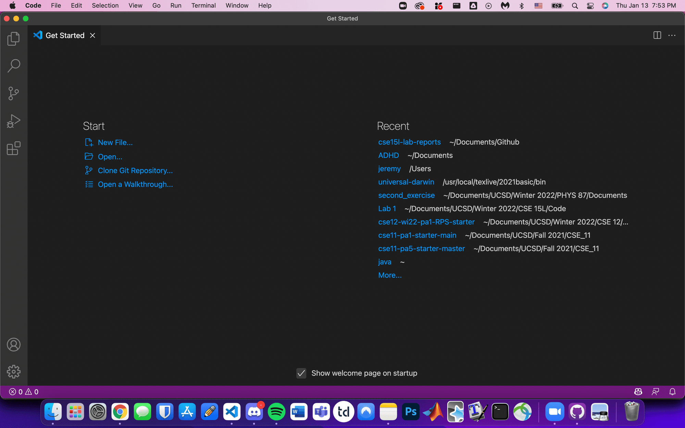
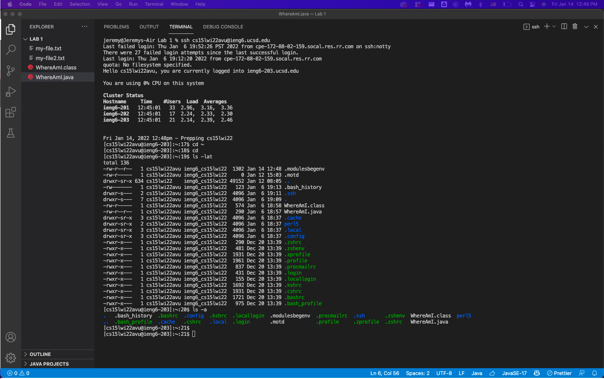
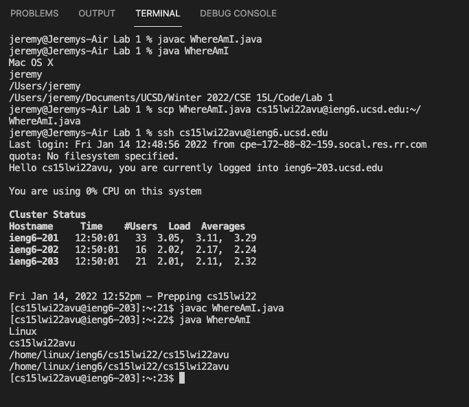
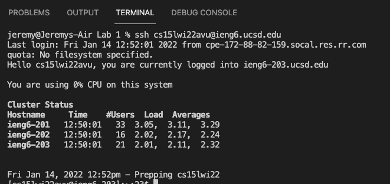
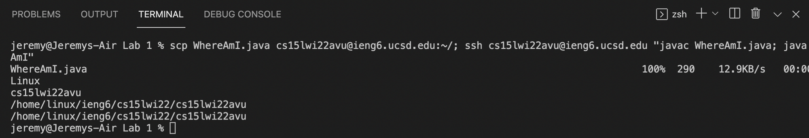

# Week 2 Lab Report

## Table of Contents
1. [Installing Visual Studio Code](#installing-visual-studio-code)
2. [Remotely connecting](#remotely-connecting)
3. [Trying some commands](#trying-some-commands)
4. [Moving files with `scp`](#moving-files-with-scp)
5. [Setting an SSH Key](#setting-an-ssh-key)
6. [Opitmizing Remote Running](#optimizing-remote-running)

# Introduction

Hi incoming 15L students (or myself). There's a crazy amount of things you can do with your computer, and I'm going to show you how to do some of them. I'll be using Visual Studio Code, which is a great tool for editing and running code. I'll be using the `scp` command to move files between computers.

1. Installing Visual Studio Code

Visual Studio Code is a great tool for editing and running code. It's free, and you can download it from the [their website here](https://code.visualstudio.com/) if you have a MacOS, Windows, or Linux device. It's not *just* a text editor but a fully-featured IDE (**I**ntegrated **D**evelopment **E**nvironment). After running the download, installing the program, and opening it, you'll see a bunch of options. Here's a screenshot of my Visual Studio Code program.



2. Remotely connecting

Next step is learning how to utilize your CSE 15L course account. The CS department at UC San Diego provides an ETS course account for all students in certain courses, and many assignments and projects require access to that course account. Today, we will be using a very useful tool known as SSH or Secure Shell.

First step is install it. For Unix-based systems such as MacOS and Linux, it will typically come pre-installed. For Windows, you'll need to download and install the SSH client OpenSSH [through this link](https://docs.microsoft.com/en-us/windows-server/administration/openssh/openssh_install_firstuse).

Here are the next steps to activating and using your CSE 15L course account.
1. Go to (https://sdacs.ucsd.edu/~icc/index.php)[https://sdacs.ucsd.edu/~icc/index.php] and input your UCSD username and PID
2. Click the big blue button that says "Submit"
3. You should see your course specific account name (cs15l\*\*\*\*\*\*) on the top
4. Click the "Change your Password" link
5. Enter your current password and your new password (note: for security reasons, this password needs to be secure and have a combination of uppercase and lowercase letters, numbers, and symbols)
6. Ensure "Change MyTritonLink password" is set to No, and "Change course-specific account password" is set to Yes
7. (This step is optional but for some, resolves issues) Do not click "Check Password" button, but after confirming your password, simply press "ENTER" or "RETURN" on your keyboard.


After waiting for 15-60 min, input the following command in the terminal:

```shell 
$ ssh cs15l\*\*\*\*\*\*@ieng6.edu
```

After that, input your new password. Note that you will not see anything when you type it in due to privacy reasons. 

If this is your first time to connect to any server, you will be prompted with this question:
```shell
$ ssh cs15l\*\*\*\*\*\*@ieng6.edu
The authenticity of host 'ieng6.ucsd.edu (128.54.70.227)' can't be established.
RSA key fingerprint is SHA256:ksruYwhnYH+sySHnHAtLUHngrPEyZTDl/1x99wUQcec.
Are you sure you want to continue connecting (yes/no/[fingerprint])? 
````

Type ```yes``` and press enter. Then, type your password again. If all is good, you will have succesfully used SSH to login to your course account! Here is an example of using SSH to login to your course account:


3. Trying some commands

There are certaintly a large number of commands you can use with your computer through the terminal when accessing your course account. Here are a few examples:

**Command**|**Explanation**
:-----:|:-----:
cd|change directory
ls|list files
pwd|print working directory
mkdir|make a new directory/folder
cp|copy
rm|remote
mv|move
scp|secure copy

Look at these commands and see what happens!
* cd ~
* cd
* ls -lat
* ls -a
* ls <directory> where <directory> is /home/linux/ieng6/cs15l\*\*\*\*/cs15l\*\*\*\*abc, where the abc is one of the other group members’ username
* cp /home/linux/ieng6/cs15lwi22/public/hello.txt ~/
* cat /home/linux/ieng6/cs15lwi22/public/hello.txt

Here\'s an example of some of those commands being run!


4. Moving files with `scp`

So far, we've seen how to use SSH to connect to your course account. Now, we'll learn how to use `scp` to move files between computers.

On your local user, or the client, create a file called `WhereAmI.java` with the following code:
```java
class WhereAmI {
  public static void main(String[] args) {
    System.out.println(System.getProperty("os.name"));
    System.out.println(System.getProperty("user.name"));
    System.out.println(System.getProperty("user.home"));
    System.out.println(System.getProperty("user.dir"));
  }
}
```

Compile it on the terminal with `javac WhereAmI.java` and run it with `java WhereAmI`. Then, in the directory, run the following command:
```shell
$ scp WhereAmI.java cs15l\*\*\*\*\*\*@ieng6.ucsd.edu:~/
```
and then type in your password again.

Now, login to the server again, and voila! you should see the file. Now compile and run the code again, and compare the output.

Here's an example of my output.


5. Setting an SSH Key

However, what you've probably noticed his how much easier it would be to not constantly set a password every time you connect to a server. You can avoid this by setting up an SSH key, which is a file that contains a private key and a public key.

Use the command ssh-keygen to generate a key, like as follows.

```shell
$ ssh-keygen
Generating public/private rsa key pair.
Enter file in which to save the key (/Users/cse15l/.ssh/id_rsa): /Users/cse15l/.ssh/id_rsa
Enter passphrase (empty for no passphrase): 
Enter same passphrase again: 
Your identification has been saved in /Users/cse15l/.ssh/id_rsa.
Your public key has been saved in /Users/cse15l/.ssh/id_rsa.pub.
The key fingerprint is:
SHA256:jZaZH6fI8E2I1D35hnvGeBePQ4ELOf2Ge+G0XknoXp0 
The key's randomart image is:
+---[RSA 3072]----+
|                 |
|       . . + .   |
|      . . B o .  |
|     . . B * +.. |
|      o S = *.B. |
|       = = O.*.*+|
|        + * *.BE+|
|           +.+.o |
|             ..  |
+----[SHA256]-----+
```

After that, if you have a Windows device, follow these steps with `ssh-add` [through this link](https://docs.microsoft.com/en-us/windows-server/administration/openssh/openssh_keymanagement#user-key-generation) to add the key to your device.

Now, you will have two new files on your device, `id_rsa` (your private key) and `id_rsa.pub` (your public key). These pair of keys are nefcessary to connect to the server securely through asymmetric cryptography.

Now, to complete the processs, copy the public key to the server.

```shell
$ ssh cs15lwi22zz@ieng6.ucsd.edu
$ mkdir .ssh
# Exit the server
$ scp /Users/cse15l/.ssh/id_rsa.pub cs15l\*\*\*\*\*\*@ieng6.edu:~/.ssh/authorized_keys
```

Congratulations! You've succcesfully set up your SSH keys and can now connect to your course account securely without having to enter your password every time.

Here is a screenshot of me running SSH without a passphrase or passcode!




6. Optimizing Remote Running

However, there are certaintly a large number of commands you can use with your computer through the terminal when accessing your course account. There are two methods to optimize the running of your remote commands.

Firstly, you can run a command directly onto the server amd then immediately disconnect. To do this in the terminal, type in the following command:
```shell
$ ssh s15l\*\*\*\*\*\*@ieng6.edu "<command>"
```
where `<command>` is the command you want to run.

Additionally, if you want to runn multiple commands on the same line, you can use the following command:
```shell
$ "<command1>;<command2>;<command3>;..."
```

Also, as a note, you can use the up arrow key to go back to the previous command in the terminal.

Here's a good example of using these two methods together to quickly send, compile and run a Java file on the server:
```shell
$ scp WhereAmI.java cs15l\*\*\*\*\*\*@ieng6.ucsd.edu:~/; ssh cs15l\*\*\*\*\*\*@ieng6.edu "javac Config.java; java Config"
```

And here it is in use!


Thank you for reading my lab report!