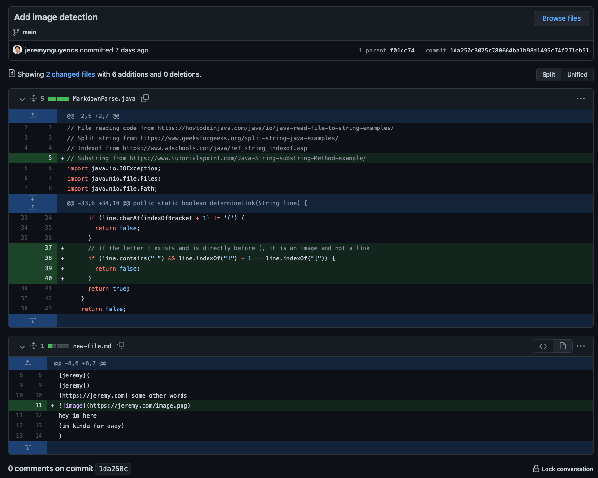
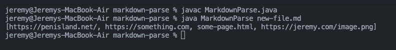
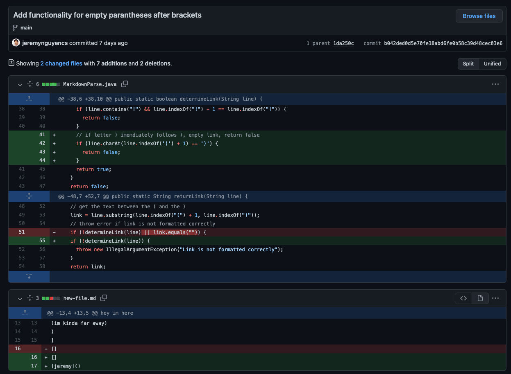
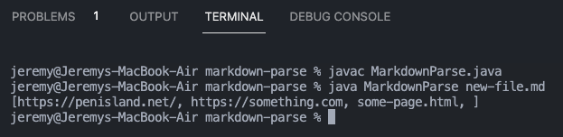
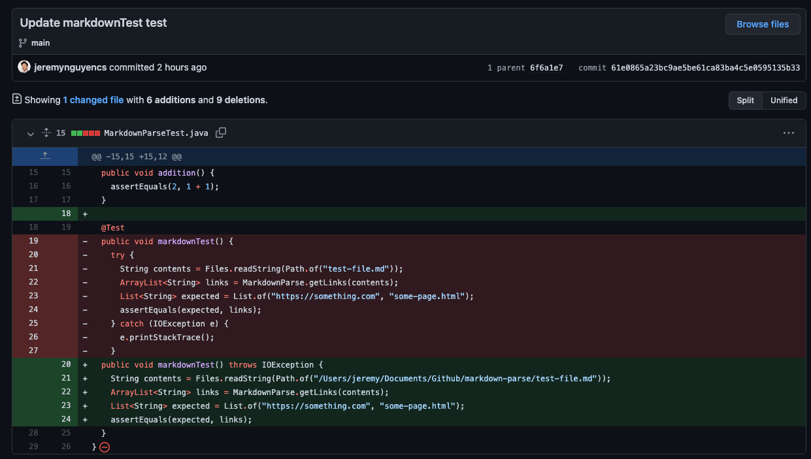
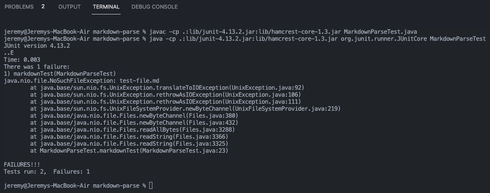

# Week 4 Lab Report 2

## Table of Contents
1. [Code Change 1](#1-code-change-1)
2. [Code Change 2](#2-code-change-2)
3. [Code Change 3](#3-code-change-3)

## 1. Code Change 1


[This is the test file that caused the failure-inducing input.](https://github.com/jeremynguyencs/markdown-parse/blob/1da250c3025c780664ba1b98d1495c74f271cb51/new-file.md) Here is the added code to that test file that led to the failure:

```markdown
<!-- new-file.md -->

```

Here is the symptom of that failure-inducing input, as it erroneously prints the image URL alongside the other links even though it is actually an image.



```shell
jeremy@Jeremys-MacBook-Air markdown-parse % javac MarkdownParse.java      
jeremy@Jeremys-MacBook-Air markdown-parse % java MarkdownParse new-file.md
[https://penisland.net/, https://something.com, some-page.html, https://jeremy.com/image.png]
```

The bug is that the MarkdownParse file parses the text of markdown images as a link even though it is actually an image. The symptom is that when I run the MarkdownParse file with a text file that contains the image, the output includes the image URL. The failure-inducing input is the text file that contains the line of text that contains the image URL in a markdown image format.


## 2. Code Change 2



[This is the test file that caused the failure-inducing input.](https://github.com/jeremynguyencs/markdown-parse/blob/b042ded0d5e70fe38abd6fe0b58c39d48cec03e6/new-file.md) Here is the added code to that test file that led to the failure:

```markdown
[jeremy]()
```

Here is the symptom of that failure-inducing input, as it erroneously prints an empty string alongside the other links even though that line does not contain a URL within the link.



The bug is that the MarkdownParse file parses the text of empty parentheses as a link if it matches the markdown URL format. The symptom is that when I run the MarkdownParse file with a text file that contains the empty parentheses, the output includes the empty string. The failure-inducing input is the text file that contains the line of text that contains the empty parentheses in a markdown link format.

## 3. Code Change 3



[This is the test file that caused the failure-inducing input.](https://github.com/jeremynguyencs/markdown-parse/blob/main/test-file.md) There is no added code to that test file but the test method itself failed and there was code added to that.

Here is the symptom of that failure-inducing input, as the test method fails and throws a ```java.nio.file.NoSuchFileException: test-file.md``` exception.



The bug is that the relative path of the ```Files.readString()``` method causes the test method to fail. The symptom is that when I run the test method, the test method fails and throws a ```java.nio.file.NoSuchFileException: test-file.md``` exception. The failure-inducing input is the `test-file.md` that is unable to be ran by the test method due to the incorect path.