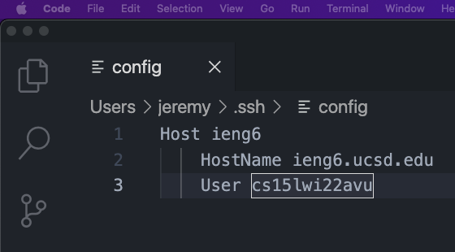
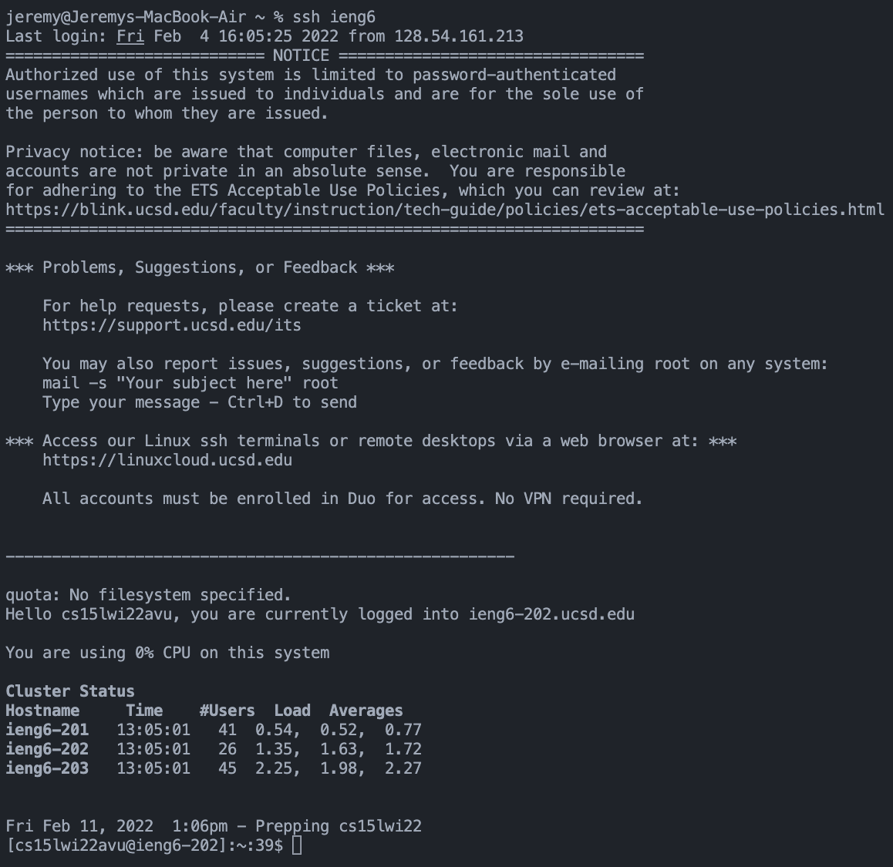

# Week 2 Lab Report: Streamlining ssh Configuration

## Table of Contents
1. [.ssh/config file](#1-installing-visual-studio-code)
2. [ssh command](#2-remotely-connecting)
3. [scp command](#3-trying-some-commands)

## 1. `.ssh/config` file
To streamline the ssh configuration, I created a file called `.ssh/config` that
contains the following information: the host (or the name of the alias),
hostname of the server, and the username (which for me is `cs15lwi22avu`).

Here is the exact text from the file:

```markdown
Host ieng6
    HostName ieng6.ucsd.edu
    User cs15lwi22avu
```

I edited this file through Visual Studio Code and here is a screenshot of that:



## 2. `ssh` command

Now, I can simply ssh into that remote server through simply ieng6 and the name
of the host or the alias. In other words, simply using `ssh ieng6` will connect
me.

Here is a screenshot of that working well.



## 1. `scp` command

In addition, using `scp` or `scp -r` will copy the file to the remote server.

Here is an example of me using the `scp` command to transfer a file called
`test-file.md` into the remote server.

