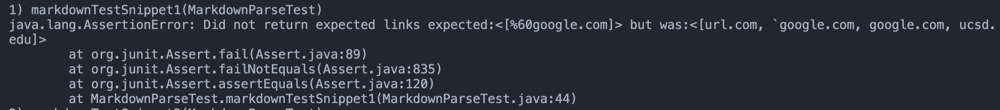
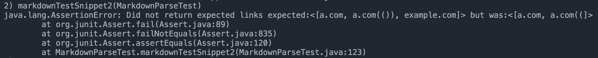
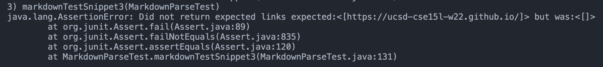
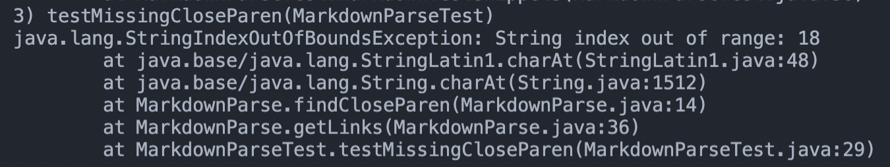

# Lab Report 4 - Week 8: Debuggers

## Table of Contents
1. [Snippet 1](#1-snippet-1)
2. [Snippet 2](#2-snipper-2)
3. [Snippet 3](#3-snippet-3)
4. [Questions and Answers](#4-questions-and-answers)

Here is a link to my own markdown-parse repository: [click here!](https://github.com/jeremynguyencs/markdown-parse)

Here is a link to the markdown-parse repository that I will be reviewing: [click here!](https://github.com/ucsd-cse15l-w22/markdown-parse)

## 1. Snippet 1
```markdown
`[a link`](url.com)

[another link](`google.com)`

[`cod[e`](google.com)

[`code]`](ucsd.edu)
```

According to [CommonMark demo site](https://spec.commonmark.org/dingus/), it should look something like this:


As a result, the only link that should be returned is `%60google.com`.

I will be using the following code to test out the `MarkdownParse.java` file in the `MarkdownParseTest.java` file through a JUnit test:

```java
@Test
public void markdownTestSnippet1() throws IOException {
  String contents = Files.readString(Path.of("snippet-1.md"));
  ArrayList<String> links = MarkdownParse.getLinks(contents);
  List<String> expected = List.of("%60google.com");
  assertEquals("Did not return expected links", expected, links);
}
```

For my own `markdown-parse` repository, here is the output and results of running the test.


For the `markdown-parse` repository that I will be reviewing, here is the output and results of running the test.



## 2. Snippet 2
```markdown
[a [nested link](a.com)](b.com)

[a nested parenthesized url](a.com(()))

[some escaped \[ brackets \]](example.com)
```

According to [CommonMark demo site](https://spec.commonmark.org/dingus/), it should look something like this:


As a result, the links that should be returned are: `a.com`, `a.com(())`, and `example.com`.

I will be using the following code to test out the `MarkdownParse.java` file in the `MarkdownParseTest.java` file through a JUnit test:

```java
@Test
public void markdownTestSnippet2() throws IOException {
  String contents = Files.readString(Path.of("snippet-2.md"));
  ArrayList<String> links = MarkdownParse.getLinks(contents);
  List<String> expected = List.of("a.com", "a.com(())", "example.com");
  assertEquals("Did not return expected links", expected, links);
}  
```

For my own `markdown-parse` repository, here is the output and results of running the test.



For the `markdown-parse` repository that I will be reviewing, here is the output and results of running the test.


## 3. Snippet 3
```markdown
[this title text is really long and takes up more than 
one line

and has some line breaks](
    https://www.twitter.com
)

[this title text is really long and takes up more than 
one line](
    https://ucsd-cse15l-w22.github.io/
)


[this link doesn't have a closing parenthesis](github.com

And there's still some more text after that.

[this link doesn't have a closing parenthesis for a while](https://cse.ucsd.edu/


)

And then there's more text
```

According to [CommonMark demo site](https://spec.commonmark.org/dingus/), it should look something like this:


As a result, the only link that should be returned is `https://ucsd-cse15l-w22.github.io/`.

I will be using the following code to test out the `MarkdownParse.java` file in the `MarkdownParseTest.java` file through a JUnit test:

```java
@Test
public void markdownTestSnippet3() throws IOException {
  String contents = Files.readString(Path.of("snippet-3.md"));
  ArrayList<String> links = MarkdownParse.getLinks(contents);
  List<String> expected = List.of("https://ucsd-cse15l-w22.github.io/");
  assertEquals("Did not return expected links", expected, links);
}
```

For my own `markdown-parse` repository, here is the output and results of running the test.



For the `markdown-parse` repository that I will be reviewing, here is the output and results of running the test.



## 4. Questions and Answers

> 1. Do you think there is a small (<10 lines) code change that will make your program work for snippet 1 and all related cases that use inline code with backticks? If yes, describe the code change. If not, describe why it would be a more involved change.

I think firstly, the way links are processed with backticks with ASCII hexcode level formatting I believe (%60), that kind of processing would be much more involved. However, otherwise, you would just have to check whether it was a codeblock or a link by checking whether it has two backticks or not.

> 2. Do you think there is a small (<10 lines) code change that will make your program work for snippet 2 and all related cases that nest parentheses, brackets, and escaped brackets? If yes, describe the code change. If not, describe why it would be a more involved change.

You would have to check for each of the brackets and parentheses to see if they are nested or not, and then check for the escaped brackets, and then after that, see if that ends up becoming a link. It would likely be a much more involved change, unfortunately.

> 3. Do you think there is a small (<10 lines) code change that will make your program work for snippet 3 and all related cases that have newlines in brackets and parentheses? If yes, describe the code change. If not, describe why it would be a more involved change.

For my code in particular, it would certainly be a much more involved change, as my code goes line-by-line in order to check for the correct links. I would need to go through the entire file and check for the correct links, rather than just checking in each line. For the other markdown files, I would need to go through the entire file and check for the correct links, rather than just checking in each line. I would also need to check for the correct links in the links that are nested in the brackets and parentheses.

For the other `markdown-parse` repository, firstly, you would need to either not use index numbers to find the location of the parantheses, or somehow obtain it while having the whole string be included while not having the index be out of bounds. It would be an involved change.